# kafka-fips-chainguard

This repository demonstrates a FIPS-aligned Kafka architecture running on Amazon EKS using:

* Chainguard FIPS-validated container images
* Mutual TLS (mTLS) for all Kafka client and inter-service traffic
* Cilium for network policy enforcement and IPsec encryption
* AES-GCM encryption for node-to-node traffic

The design enforces strong cryptographic boundaries, explicit east-west network controls, and modern TLS standards suitable for regulated environments.

<p align="center">
  
</p>

**DOCUMENTATION AREAS**

### Cryptography
* ✅ FIPS-validated Chainguard images (Kafka Proxy and Cilium)
* ✅ TLS 1.2 / 1.3 only (TLS 1.0 / 1.1 rejected)
* ✅ Secrets mounted for certificate management
* ✅ mTLS authentication enforced
* ✅ Approved cipher suites only
* ✅ AES-GCM (RFC4106 gcm(aes)) for IPsec
* ✅ Cilium default-deny network policies
* ✅ Explicit allow-list between tiers
* ✅ TLS required on all Kafka listeners
* ✅ No plaintext listeners exposed
* ✅ StatefulSet isolation for brokers and controllers

Additional Reccomendation:
* OS in FIPS mode (proc/sys/crypto/fips_enabled = 1)

# IAMGUARDED Kafka Deployment Setup

### Create cluster UID

```
docker run --rm cgr.dev/chainguard-private/kafka:latest \
  kafka-storage.sh random-uuid
```

### Generate TLS certs (Skip to generating secret if you already have keys)

```
openssl genrsa -out ca.key 4096

openssl req -x509 -new -nodes \
  -key ca.key \
  -sha256 \
  -days 3650 \
  -out ca.crt \
  -subj "/CN=kafka-mtls-ca"

# PROXY leaf (uses SANs+EKUs from kafka-openssl.cnf)
openssl genrsa -out proxy.key 4096

openssl req -new \
  -key proxy.key \
  -out proxy.csr \
  -config kafka-openssl.cnf

openssl x509 -req \
  -in proxy.csr \
  -CA ca.crt \
  -CAkey ca.key \
  -CAcreateserial \
  -out proxy.crt \
  -days 365 \
  -sha256 \
  -extfile kafka-openssl.cnf \
  -extensions v3_req

# CLIENT leaf (simple client cert; optional to also give SANs/EKU via cnf)
openssl genrsa -out client.key 4096

openssl req -new \
  -key client.key \
  -out client.csr \
  -subj "/CN=kafka-client"

openssl x509 -req \
  -in client.csr \
  -CA ca.crt \
  -CAkey ca.key \
  -CAcreateserial \
  -out client.crt \
  -days 365 \
  -sha256
```

### Generate TLS Secret
```
kubectl -n kafka create secret generic kafka-tls \
  --from-file=tls.crt=proxy.crt \
  --from-file=tls.key=proxy.key \
  --from-file=ca.crt=ca.crt \
  --dry-run=client -o yaml | kubectl apply -f -

kubectl -n kafka create secret generic kafka-client-mtls \
  --from-file=ca.crt=ca.crt \
  --from-file=client.crt=client.crt \
  --from-file=client.key=client.key \
  --dry-run=client -o yaml | kubectl apply -f -

kubectl -n kafka create secret generic kafka-proxy-mtls \
  --from-file=ca.crt=ca.crt \
  --from-file=tls.crt=proxy.crt \
  --from-file=tls.key=proxy.key \
  --dry-run=client -o yaml | kubectl apply -f -
```

### Generate keystores and Truststores for JKS

```
KEYPASS="$(openssl rand -hex 24)"
TRUSTPASS="$(openssl rand -hex 24)"

echo "KEYPASS=$KEYPASS"
echo "TRUSTPASS=$TRUSTPASS"

kubectl -n kafka create secret generic kafka-tls-passwords \
  --from-literal=keystore-password="$KEYPASS" \
  --from-literal=truststore-password="$TRUSTPASS" \
  --dry-run=client -o yaml | kubectl apply -f -
  ```

### Generate JKS Secrets for Iamguarded Chainguard Configuration

```
openssl pkcs8 -topk8 -nocrypt -in proxy.key -out proxy.pkcs8.key

openssl pkcs12 -export \
  -in proxy.crt \
  -inkey proxy.pkcs8.key \
  -certfile ca.crt \
  -name kafka \
  -passout pass:"$KEYPASS" \
  -out kafka.keystore.p12

keytool -importkeystore \
  -srckeystore kafka.keystore.p12 \
  -srcstoretype PKCS12 \
  -srcstorepass "$KEYPASS" \
  -destkeystore kafka.keystore.jks \
  -deststoretype JKS \
  -deststorepass "$KEYPASS" \
  -noprompt

keytool -importcert \
  -alias CARoot \
  -file ca.crt \
  -keystore kafka.truststore.jks \
  -storepass "$TRUSTPASS" \
  -noprompt

kubectl -n kafka create secret generic kafka-jks \
  --from-file=kafka.keystore.jks=./kafka.keystore.jks \
  --from-file=kafka.truststore.jks=./kafka.truststore.jks \
  --dry-run=client -o yaml | kubectl apply -f -
```


## Deploy Kafka Brokers (Chainguard Iamguarded Chart)

```
helm upgrade --install kafka oci://cgr.dev/chainguard-private/iamguarded-charts/kafka \
  -n kafka --create-namespace \
  -f kafka-helm/values.yaml
```

### Tests & Confirmation

```
kubectl -n kafka exec kafka-broker-0 -c kafka -- sh -lc '
cat >/tmp/client-ssl.properties <<EOF
security.protocol=SSL
ssl.endpoint.identification.algorithm=https

ssl.truststore.location=/opt/iamguarded/kafka/config/certs/kafka.truststore.jks
ssl.truststore.password=$(grep -m1 "^ssl.truststore.password=" /opt/iamguarded/kafka/config/server.properties | cut -d= -f2)

ssl.keystore.location=/opt/iamguarded/kafka/config/certs/kafka.keystore.jks
ssl.keystore.password=$(grep -m1 "^ssl.keystore.password=" /opt/iamguarded/kafka/config/server.properties | cut -d= -f2)
ssl.key.password=$(grep -m1 "^ssl.keystore.password=" /opt/iamguarded/kafka/config/server.properties | cut -d= -f2)
EOF

echo "Wrote /tmp/client-ssl.properties"
ls -l /tmp/client-ssl.properties
'
```
#### Smoke Test

```
kubectl -n kafka exec kafka-broker-0 -c kafka -- sh -lc '
/opt/iamguarded/kafka/bin/kafka-topics.sh \
  --bootstrap-server kafka-broker-headless.kafka.svc:9094 \
  --command-config /tmp/client-ssl.properties \
  --create --if-not-exists \
  --topic smoke-test --partitions 3 --replication-factor 3
'

kubectl -n kafka exec -i kafka-broker-0 -c kafka -- sh -lc '
echo "hello-$(date +%s)" | /opt/iamguarded/kafka/bin/kafka-console-producer.sh \
  --bootstrap-server kafka-broker-headless.kafka.svc:9094 \
  --producer.config /tmp/client-ssl.properties \
  --topic smoke-test \
  --request-required-acks all \
  --producer-property linger.ms=0 \
  --producer-property retries=3 \
  --producer-property delivery.timeout.ms=15000
echo "producer-exit-code=$?"
'

kubectl -n kafka exec kafka-broker-0 -c kafka -- sh -lc '
/opt/iamguarded/kafka/bin/kafka-console-consumer.sh \
  --bootstrap-server kafka-broker-headless.kafka.svc:9094 \
  --consumer.config /tmp/client-ssl.properties \
  --topic smoke-test \
  --group smoke-test-g1 \
  --from-beginning \
  --timeout-ms 20000 \
  --max-messages 5
echo "consumer-exit-code=$?"
'

```
## Deploy proxy-fips

```
helm upgrade --install kafka-proxy ./charts/kafka-proxy-fips \
  -n kafka
```

#### Smoke Test

**Create client test pod"** 

```
kubectl -n kafka apply -f - <<'YAML'
apiVersion: v1
kind: Pod
metadata:
  name: kafka-client-test
  namespace: kafka
  labels:
    app: kafka-client-test
spec:
  restartPolicy: Never
  containers:
  - name: client
    image: 452336408843.dkr.ecr.us-west-2.amazonaws.com/kafka:iamguarded-cg
    command: ["sh","-lc","sleep 365000"]
    volumeMounts:
    - name: mtls
      mountPath: /tls
      readOnly: true
  volumes:
  - name: mtls
    secret:
      secretName: kafka-client-mtls
YAML
```

**Test the api from the proxy:** 

```
kubectl -n kafka exec kafka-client-test -- \
  /opt/iamguarded/kafka/bin/kafka-broker-api-versions.sh \
  --bootstrap-server kafka-proxy-0.kafka.svc.cluster.local:9094 \
  --command-config /tmp/client.properties | head -n 60

kubectl -n kafka exec -i kafka-client-test -- sh -lc '
echo "hello-$(date +%s)" | /opt/iamguarded/kafka/bin/kafka-console-producer.sh \
  --bootstrap-server kafka-proxy-0.kafka.svc.cluster.local:9094 \
  --producer.config /tmp/client.properties \
  --topic smoke-test
'

kubectl -n kafka exec kafka-client-test -- sh -lc '
/opt/iamguarded/kafka/bin/kafka-console-consumer.sh \
  --bootstrap-server kafka-proxy-0.kafka.svc.cluster.local:9094 \
  --consumer.config /tmp/client.properties \
  --topic smoke-test --from-beginning \
  --max-messages 5 --timeout-ms 15000
'
```

**End-to-end mTLS test:**

```
kubectl -n kafka exec kafka-client-test -- sh -lc '
/opt/iamguarded/kafka/bin/kafka-topics.sh \
  --bootstrap-server kafka-proxy-0.kafka.svc.cluster.local:9094 \
  --command-config /tmp/client.properties \
  --create --if-not-exists \
  --topic smoke-test --partitions 3 --replication-factor 3
'
```
## Cilium FIPS

### Configure CIPHER Suite Secret for Encryption

```
kubectl -n kube-system create secret generic cilium-ipsec-keys \
  --from-literal=keys="1 rfc4106(gcm(aes)) $(openssl rand -hex 20) 128" \
  --dry-run=client -o yaml | kubectl apply -f -
```

Note: the algorithm used and enforced is reccomended for encryption in this use case

### Installation 

```
helm repo add cilium https://helm.cilium.io/
helm repo update
```

```
helm upgrade --install cilium cilium/cilium \
  -n kube-system --create-namespace \
  --version 1.16.6 \
  -f cilium/values.yaml
```

### Apply FIPS restrictive network policies for Cilium

```
kubectl apply -f cilium/fips-network-policies/kafka-cilium-netpol.yaml
```

**Verify Encryption** 

```
kubectl -n kube-system exec ds/cilium -- cilium status | grep Encryption

kubectl -n kube-system exec ds/cilium -- ip -s xfrm state

kubectl -n kube-system exec ds/cilium -- cilium encrypt status

kubectl -n kube-system exec ds/cilium -- sh -lc "ip -s xfrm state | egrep -n 'aead|auth|enc|rfc4106|gcm|cbc|sha' | head -n 50"
```

**Confirm Network Policy Enforcement:**

```
kubectl -n kafka get ciliumnetworkpolicies

kubectl -n kube-system exec ds/cilium -- cilium status | grep Policy
``` 

## Test FIPS Configurations

**SUCCESS**
```
kubectl -n kafka exec kafka-client-test -- sh -lc '
echo "== EXPECTED SUCCESS: TLS1.3 AES-GCM =="
openssl s_client \
  -connect kafka-proxy-0.kafka.svc.cluster.local:9094 \
  -servername kafka-proxy-0.kafka.svc.cluster.local \
  -CAfile /tls/ca.crt \
  -tls1_3 \
  -ciphersuites TLS_AES_256_GCM_SHA384 \
  -verify_return_error \
  -brief < /dev/null
echo "exit-code=$?"
'
```
**FAILURE** 
```
kubectl -n kafka exec kafka-client-test -- sh -lc '
echo "== EXPECTED FAIL (if FIPS-only ciphers): TLS1.3 CHACHA20 =="
openssl s_client \
  -connect kafka-proxy-0.kafka.svc.cluster.local:9094 \
  -servername kafka-proxy-0.kafka.svc.cluster.local \
  -CAfile /tls/ca.crt \
  -tls1_3 \
  -ciphersuites TLS_CHACHA20_POLY1305_SHA256 \
  -verify_return_error \
  -brief < /dev/null
echo "exit-code=$?"
'
```

**confirm failure for PLAINTEXT**
```
kubectl -n kafka exec kafka-client-test -- sh -lc '
echo "== EXPECTED SUCCESS: create topic via proxy TLS =="
/opt/iamguarded/kafka/bin/kafka-topics.sh \
  --bootstrap-server kafka-proxy-0.kafka.svc.cluster.local:9094 \
  --command-config /tmp/client.properties \
  --create --if-not-exists --topic fips-ok \
  --partitions 1 --replication-factor 1

echo "exit-code=$?"
'
```